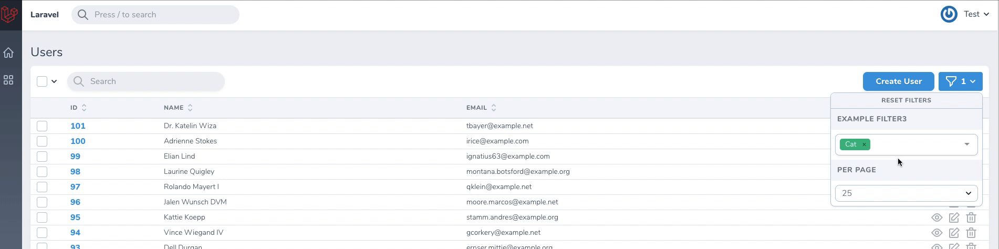

# Nova Multiselect Filter & Field with ajax 

[](https://packagist.org/packages/dpsoft/nova-multiselect-filter)
[](https://packagist.org/packages/dpsoft/nova-multiselect-filter)

This [Laravel Nova](https://nova.laravel.com) package adds a multiselect to Nova's filters and form fields.

## Requirements

- `laravel/nova: ^3.0`

## Features

- Multi select
- Single select
- Group select
- Search

## Screenshots

### Multiselect


### Groupselect



## Installation

Install the package in a Laravel Nova project via Composer:

```bash
composer require dpsoft/nova-multiselect-filter
```

## Usage

### As a Filter

The filter can be used when switching `Filter` class with `MultiselectFilter`.

```php
use Dpsoft\NovaMultiselectFilter\MultiselectFilter;

class BooksByAuthorFilter extends MultiselectFilter
{
    public function apply(Request $request, $query, $value)
    {
        return $query->whereHas('books', function ($query) use ($value) {
            $query->whereIn('author_id', $value);
        });
    }

    public function options(Request $request)
    {
        return Authors::all()->pluck('name', 'id');
    }
}
```

### As a Form Field

The field can be used in Nova resources for form input:

```php
use Dpsoft\NovaMultiselectFilter\MultiselectField;

public function fields(Request $request)
{
    return [
        MultiselectField::make('Categories')
            ->options([
                'tech' => 'Technology',
                'business' => 'Business', 
                'science' => 'Science'
            ])
            ->placeholder('Select categories'),
            
        MultiselectField::make('Tags')
            ->options(Tag::all()->pluck('name', 'id'))
            ->singleSelect() // For single selection
            ->max(3), // Maximum 3 selections
    ];
}
### Built-in server-side search endpoint

```php
use Dpsoft\NovaMultiselectFilter\MultiselectFilter;

class UsersByRoleFilter extends MultiselectFilter
{
    public function __construct()
    {
        $this->model(\App\Models\Role::class)
             ->searchColumn('name')
             ->minChars(2)
             ->debounce(300);
    }

    public function apply(Request $request, $query, $value)
    {
        return $query->whereIn('role_id', $value);
    }
}
```
### Option groups

Option groups are supported. Their syntax is the same as [Laravel's option group syntax](https://nova.laravel.com/docs/2.0/resources/fields.html#select-field).

In this example (from Nova docs), all values are grouped by the `group` key:

```php
    public function options(Request $request)
    {
        return [
          'cat' => ['label' => 'Cat', 'group' => 'Pets'],
          'dog' => ['label' => 'Dog', 'group' => 'Pets'],
          'eagle' => ['label' => 'Eagle', 'group' => 'Birds'],
          'parrot' => ['label' => 'Parrot', 'group' => 'Birds'],
        ]
    }
```

## Options

Possible options you can pass to the filter using the option name as a function, ie `->placeholder('Choose peanuts')`.

| Option         | type            | default    | description                                                                                            |
| -------------- | --------------- | ---------- | ------------------------------------------------------------------------------------------------------ |
| `options`      | Array\|callable | []         | Options in an array as key-value pairs (`['id' => 'value']`).                                          |
| `placeholder`  | String          | Field name | The placeholder string for the input.                                                                  |
| `max`          | Number          | Infinite   | The maximum number of options a user can select.                                                       |
| `groupSelect`  | Boolean         | false      | For use with option groups - allows the user to select whole groups at once                            |
| `singleSelect` | Boolean         | false      | Makes the field act as a single select which also means the saved value will not be an array.          |
| `optionsLimit` | Number          | 1000       | The maximum number of options displayed at once. Other options are still accessible through searching. |
| `ajaxEndpoint` | String          | null       | Custom endpoint to search and return options for async search. Defaults to `/nova-vendor/nova-multiselect-filter/search`. |
| `ajaxMethod`   | String          | get        | Request method for async search. |
| `ajaxParam`    | String          | search     | Query param name for the search term. |
| `debounce`     | Number          | 300        | Debounce in milliseconds for async search. |
| `minChars`     | Number          | 0          | Minimum characters before search triggers. |
| `model`        | String          | null       | Fully qualified model class name used by the built-in search endpoint. |
| `searchColumn` | String          | null       | Column name used by the built-in search endpoint. |


## Credits

- [Kaspar Rosin](https://github.com/kasparrosin)
- [Tarvo Reinpalu](https://github.com/Tarpsvo)
- [shentao/vue-multiselect](https://github.com/shentao/vue-multiselect)
- [All Contributors](https://github.com/dpsoft/nova-multiselect-filter/graphs/contributors)

This package was inspired by [klepak/nova-multiselect-filter](https://github.com/klepak/nova-multiselect-filter)

## License

This project is open-sourced software licensed under the [MIT license](LICENSE.md).
